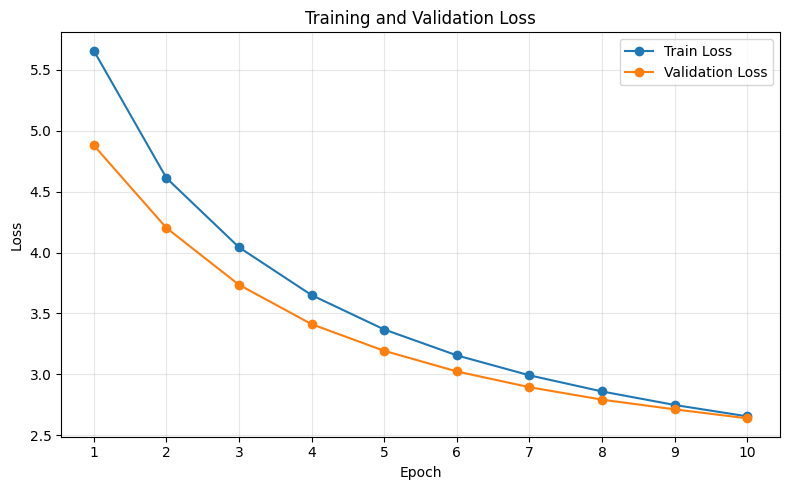
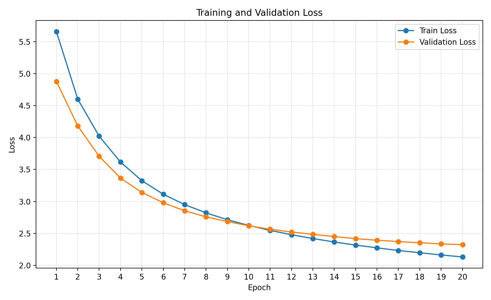

# Machine Translation
Implementation of original Encoder-Decoder transformer architecture for English-German Translation
<p align="center">
  
  <br>
  <em>Source: Attention Is All You Need (2017)</em>
</p>

## About
This project aims to utilize the classical Encoder-Decoder architecture to perform machine translation on the [IWSLT14 dataset](https://www.kaggle.com/datasets/qcriwgao/iwslt14).

## Project Structure
```text
Machine Translation/
├── artifacts/        
    ├── vocabs                # Extracted dictionaries
    ├── checkpoints          
        ├── train0            # Training session saving: model weights, training and validation loss
        ├── train1
        ├── ...
├── assets/                   # Visual aids for README
├── datasets/                 # IWSLT14
├── src/
    ├── dataset_processing/   # Dataset loading and vocab extraction
    ├── evaluation/           # Perform BLEU scoring
    ├── training/             # Model training utilities
    ├── transformer/          # Transformer modules and models architecture
    ├── config.py             # Predefined constants for settings of dataset, model and training
├── .gitattributes
├── .gitignore
├── README.md
````

## Model Architecture
The architecture used for the project is **Encoder-Decoder** structure, with the **Encoder** to perform reading and generating rich contextual representations of the input sequences while the **Decoder** produces corresponding target sequences token-by-token (auto-regressive). The main components of the model including:

- **Token Embedding**: Converting tokens into high-dimensional vector
- **Positional Encoding**: Injecting embedding vectors with positional information of the tokens
- **Self-Attention Mechanism**: For every tokens, the model generates three vectors: **Query (Q)**, **Key (K)** and **Value (V)**, which then be aggregated into three matrices. After that, the model perform attention score calculation to determine the mutual relationships between every pairs of tokens.
- **Multi-head Attention**: Run multiple self-attention mechanisms in parallel to learn more variety of contextual and lingustic nuances between tokens while keeping the computational cost comparable to single self-attention head.

Here are the model settings used in this project. The following configurations are contained in config.py.
```python
# Model settings
D_MODEL = 256
N_HEAD = 4
NUM_ENCODER_LAYERS = 3
NUM_DECODER_LAYERS = 3
DIM_FEEDFORWARD = 1024
DROPOUT = 0.1
```
## Dataset
The **IWSLT14 dataset** contains three splits including **train**, **evaluation** and **test**. Each split consists of two parallel text files of **Byte Pair Encoding (BPE)** tokenized sentences, aligned in line-by-line manner. Table 1 summarizes the number of samples for each category.

<div align="center">

**Table 1. Statistics of the IWSLT14 German–English dataset**

| Split | Samples |
|:-----|:--------|
| Train | 160,239 |
| Validation | 7,283 |
| Test | 6,750 |

</div>

## Checkpoint
Pretrained weights and training logs are available in the repository at:

```text
Machine Translation/
├── artifacts/
    ├── checkpoints
        ├── train0
            ├──best_translation_model.pt
        ├── train1
            ├──best_translation_model.pt
        ...
```

To use the pretrained weights, architecture generation is required in advanced. The necessary APIs are provided in:

```text
Machine Translation/
├── src
    ├── training
        ├── training_utils.py
```

Both pretrained models share the same architectural and **EN - DE** training configurations. The only difference is the number of training epochs: the model in **train0** was trained for **10 epochs** while the other one in **train1** was trained for **20 epoches**. The training and validation log of both models are presented as Figure 1 and Figure 2 respectively.

<p align="center">
  <em>Figure 1. Training and validation loss of model "train0".</em>
  <br>
  
</p>


<p align="center">
  <em>Figure 2. Training and validation loss of model "train1".</em>
  <br>
  
</p>

After the training session, both models undergone BLEU scoring on **test** dataset, achieving 22.25 and 26.94 respectively. Table 2 compares the BLEU evaluation of our best model against state-of-the-art methods:

<div align="center">

**Table 2. Comparison with SOTA methods in BLEU scoring**

| Method | IWSLT14 EN - DE |
|:-----|:--------|
| Ours | 26.94 |
| Transformer-base/big | 28.5 |
| Relative Position | 29.6 |
| RoPE | 29.9 |
| Deps-SAN | 30.4 |
| Dependency Transformer | 30.8 |
| SDAtt | 30.1 |
| GraphRel | 30.0 |
| DASA | 31.2 |

*Source: Dependency-aware self-attention for robust neural machine translation (2026)*
</div>

## Installation

Clone the repository and navigate to project directory:
```bash
git clone https://github.com/haovo3326/Machine-Translation.git
cd Machine-Translation
```
Create a virtual environment (optional):
```bash
conda create -n machine-translation python=3.11
conda activate machine-translation
```

Install the required dependencies:
```bash
pip install -r requirements.txt
```
 


